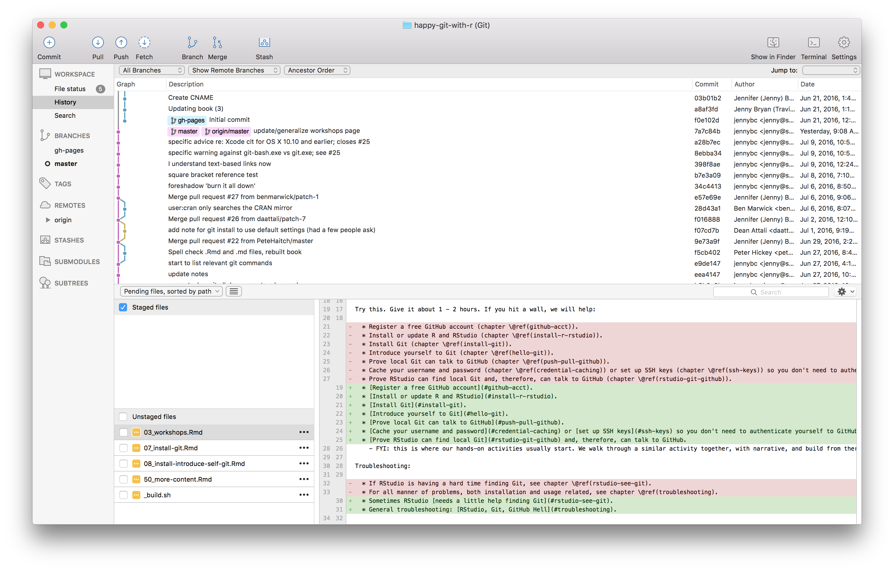
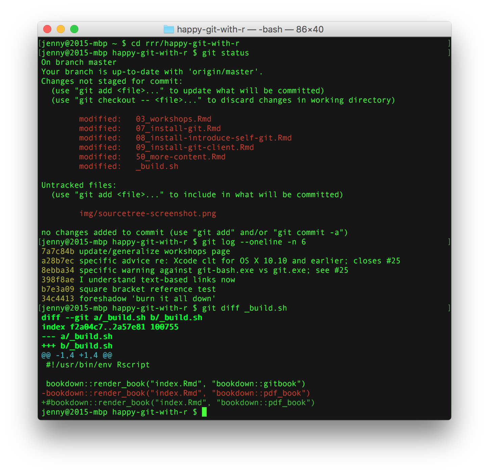

# Install a Git client {#git-client}

This is optional but **highly recommended**.

Unless specified, it is not required for live workshops and will not be explicitly taught, though you might see us using one of these clients.

## What and why

Learning to use version control can be rough at first. I found the use of a GUI – as opposed to the command line – extremely helpful when I was getting started. I call this sort of helper application a Git client. It's really a Git(Hub) client because they also help you interact with GitHub or other remotes.

Git and your Git client are not the same thing, just like R and RStudio are not the same thing. A Git client and the RStudio IDE are not necessary to use Git or R, respectively, but they make the experience more pleasant because they reduce the amount of [command line bullshittery](http://www.pgbovine.net/command-line-bullshittery.htm).

RStudio offers a very basic Git client. I use this often for simple operations, but you probably want another, more powerful one as well.

Fair warning: for some things, you will have to use the command line. But the more powerful your Git client is, the less often this happens.

Fantastic news: because all of the clients are just forming and executing Git commands on your behalf, you don't have to pick one. You can literally do one operation from the command line, do another from RStudio, and another from SourceTree, one after the other, and it just works. *Very rarely, both clients will scan the repo at the same time and you'll get an error message about `.git/index.lock`. Try the operation again at least once before doing any further troubleshooting.*

## A picture is worth a thousand words

Here's a screenshot of SourceTree (see below) open to the repository for this site. You get a nice graphical overview of the recent commit history, branches, and diffs, as well as a GUI that facilitates the most common Git operations.

In contrast, here's a shell session where I've used command line Git to access some of the same information.

Which do you prefer?

## Recommended Git clients

<!-- https://twitter.com/JennyBryan/status/734894596019224576 -->

  * [SourceTree](http://www.sourcetreeapp.com) is a free, powerful Git(Hub) client that I highly recommend. It was my first Git client and is still my favorite for nontrivial Git tasks. Available for Mac and Windows. If I'm teaching you in a course or workshop, you might see me using this.

  * [GitKraken](https://www.gitkraken.com) is quite new on the scene and is free. I would probably start here if I was starting today. Why? Because it works across all three OSes my students use: Windows, Mac, and Linux. I hear very good reviews, especially from long-suffering Linux users who haven't had any great options until now.

  * [GitUp](http://gitup.co) is a free, open source client for Mac OS. I've heard really good things about it and like what I read on the website. However, I tried to make myself use it for a day and went sort of nuts, possibly because I'm so used to SourceTree. YMMV.
  
  * GitHub also offers [a free Git(Hub) client](https://desktop.github.com/) for Windows and Mac. We do NOT recommend it for Windows and have serious reservations even for Mac OS. What do we object to?
    - The degree of hand-holding offered by GitHub's clients borders on hand-*cuffs*.
    - The Windows client sometimes leaves the Git executable so well hidden that we can't find it. This is a deal-killer, because that means RStudio can't find it either.
    - These clients wrap Git functionality so thoroughly that we've had students make some destructive mistakes. For example, we've seen a "sync" operation that resulted in the loss of local uncommitted changes. Exactly which Git operations, in what order, are implied by "sync", is [not entirely clear](http://stackoverflow.com/questions/12104513/what-does-github-for-windows-sync-do). We prefer clients that expose Git more explicitly.
    - We've heard similar negative reviews from other instructors. It's not just us.

  * Others that I have heard positive reviews for:
  
    - [SmartGit](http://www.syntevo.com/smartgit/)
    - [git-cola](https://git-cola.github.io)
    - [magit](https://magit.vc), for Emacs nerds

  * Browse [even more Git(Hub) clients](http://git-scm.com/downloads/guis).
